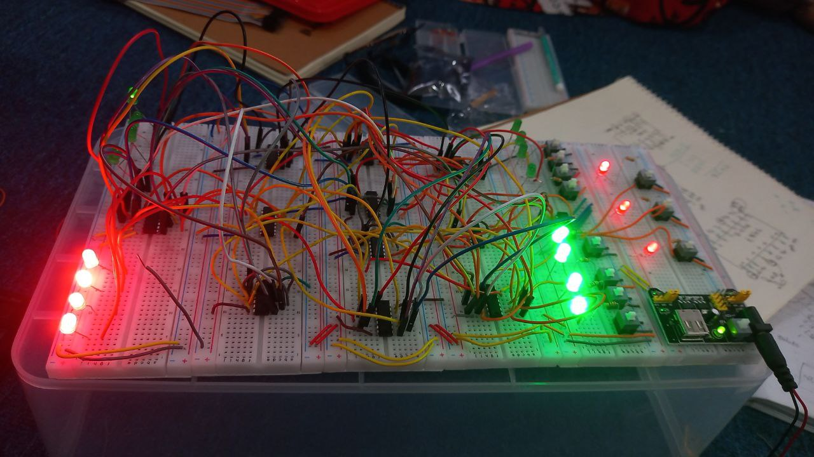
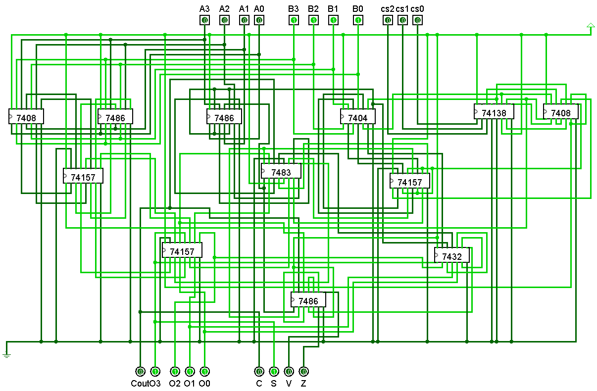

# ALU

## Content
- [Spec](#spec)
- [Circuit Design](#circuit_design)
- [Software Simulation using LOGISIM](#software-simulation-using-logisim)
- [Report](./Report/)
- [Usefool Tools](#useful-tools)
	- Wire Counter
	- Tester (Credit to [aaniksahaa](https://github.com/aaniksahaa) for this amazing tester, I modified it to support file output)
- [ICs and symbols used](#ics-and-symbols-used)

## Spec
We designed a 4 bit ALU which implemented the following functions using three control signals as well as C, S, Z and F flags.

| $cs_{2}$ | $cs_{1}$ | $cs_{0}$ | **Function**              | **Description**            |
|----------|----------|----------|---------------------------|----------------------------|
| 0        | X        | 0        | Decrement A               | $A$ - 1                      |
| 0        | 0        | 1        | Subtract with borrow      | $A$ + $\overline{B}$ (i.e. A - B - 1) |
| 0        | 1        | 1        | NEG A                     | $\overline{A}$ + 1         |
| 1        | 0        | 0        | Subtract                  | $A$ + $\overline{B}$ + 1 (i.e. A - B) |
| 1        | 0        | 1        | AND                       | $A$ $\land$ $B$                |
| 1        | 1        | X        | XOR                       | $A$ $\oplus$ $B$               |

For details check the [spec](./CSE-306-Assignment-1-V1.pdf)

## Circuit Design 
The original circuit had a bug which were fixed using this [file](Fix.md). \
Also for the intuitions behind the design check [optimization](Optimization.md)

## Software Simulation using LOGISIM

1. For Logisim(2.7.1), download [EXE](https://sourceforge.net/projects/circuit/files/2.7.x/2.7.1/) (Requires JRE 1.5.0) or [JAR](https://sourceforge.net/projects/circuit/files/2.7.x/2.7.1/logisim-generic-2.7.1.jar/download) (Works for JRE >= 1.5.0).

2. I originally downloaded the 7400-lib.circ. But it had a bug related to the IC-7483. The $C_{out}$ pin was an input pin instead of the desired output pin.So I fixed that IC using this [.circ](./Circuits/IC%207483.circ) file .Also I made some changes to the 7400-lib.circ file for the design.
3. Make sure that the modified [7400-lib.circ](./Circuits/7400-lib.circ), the fixed [IC-7483](./Circuits/IC%207483.circ) and the [ALU](./Circuits/final%20ALU.circ) are in the same directory.
4. Open the [final ALU.circ](./Circuits/final%20ALU.circ) in logisim. A circuit similar to the following should open :-

## Useful Tools
- [Wire Counter](wireCount.py) calculates the number of wires used in a .circ file. 
	- Make sure that your.circ file(whose wire is to be counted) and the wireCount.py are in the same directory.
	- Replace the file_path with the name of `your.circ` and run the .py.
	- An estimate will be given.

- [Tester](./Tester/check_ALU.py) checks whether the truth table generated from the ALU.circ is correct or not.
	* Open the circuit in Logisim
	* Go to the `Project` tab and click `Analyze Circuit`
	* A warning dialog box may appear, click `OK`
	* The truth table is shown.
	* Press `Ctrl`+`A`. Copy.
	* Paste the output here in `truth_table.txt`
	* **Most importantly, in the code, change the functions as per your specifications.**
	* Run `check_ALU.py`
	* For the entire report, check the generated `report.txt`.

	The followed naming convention:

		Control bits = cs0, cs1, cs2
		A            = A0, A1 etc
		B            = B0, B1 etc
		S            = S0, S1 etc
		Cout         = Cout
		C, V, S and Z are the status flags

## ICs and symbols used
[Here](Gates.md) is a list of ICs, symbols and their meanings used in the ALU.